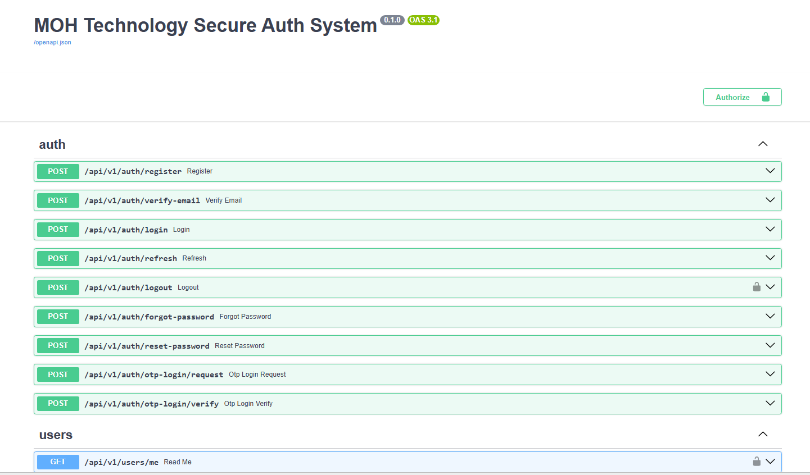
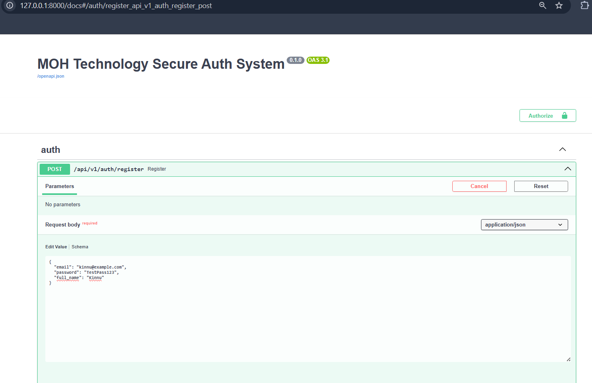
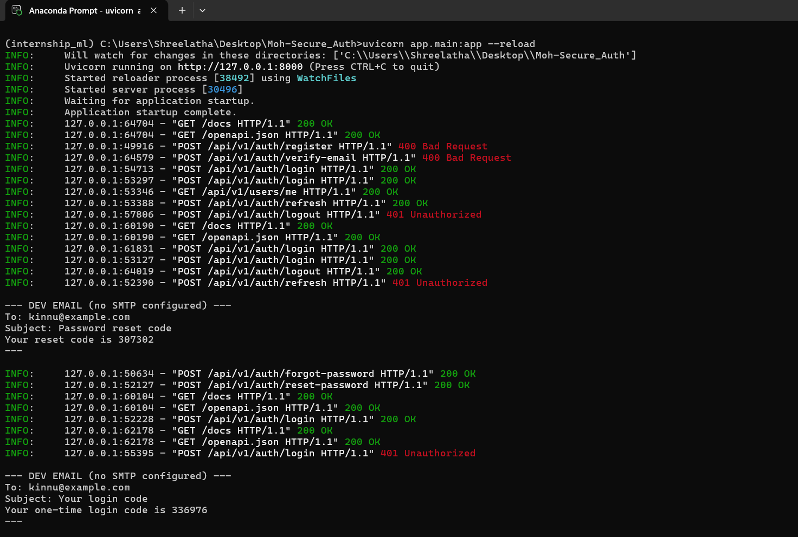
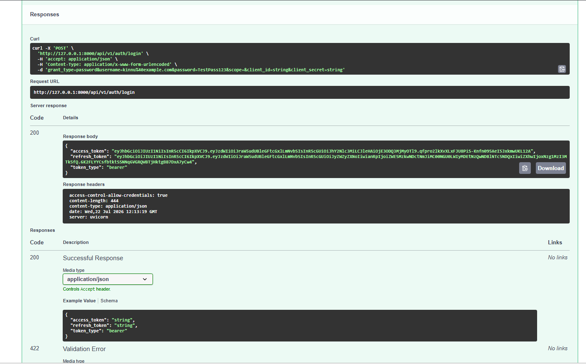
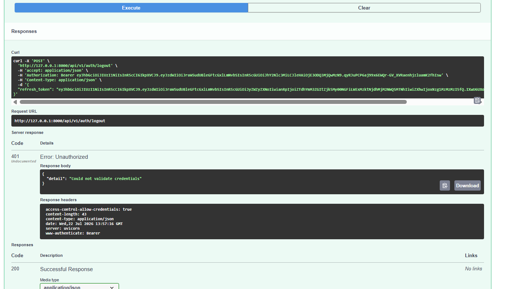
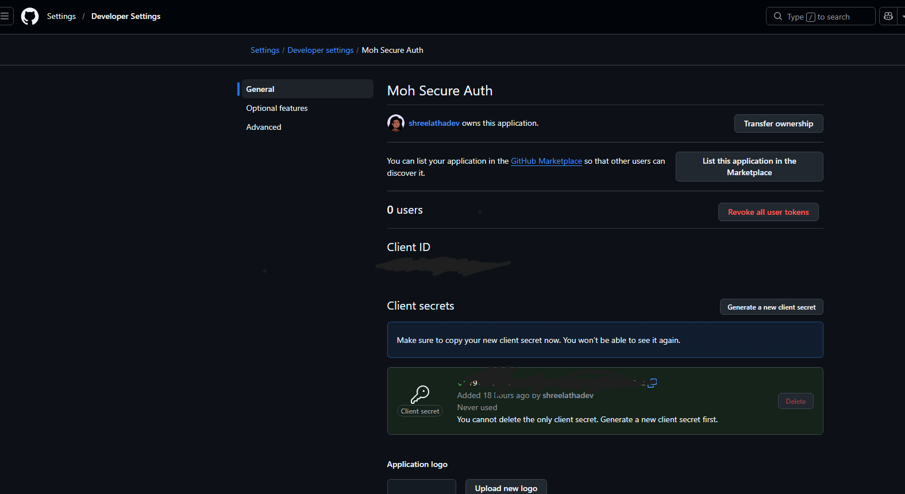
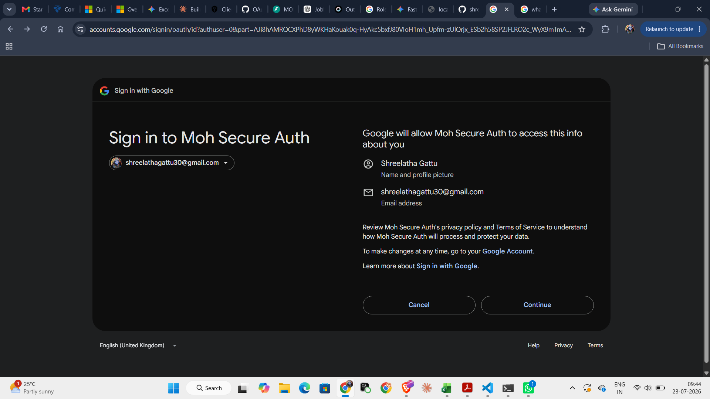
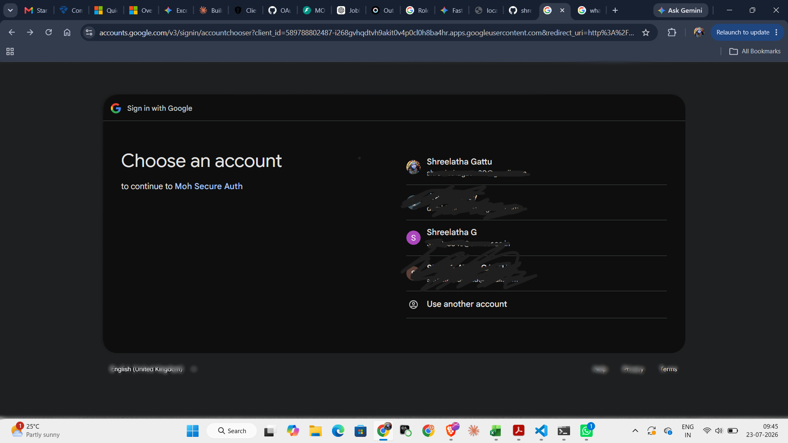

# Testing Screenshots — Moh Secure Auth

All endpoints were manually tested via Swagger UI (`/docs`) and, for OAuth, directly in the browser. Screenshots below correspond to the testing checklist in the README.

## 1. Available Endpoints (Swagger UI)

## 2. Register

## 3. Email OTP (dev console output)

## 4. Login — JWT Access & Refresh Tokens

## 5. Full Flow Log (register → verify → login → /me → refresh → logout → forgot/reset password → OTP login)

## 6. Logout — Refresh Token Correctly Revoked
Proof that a refresh token is rejected after logout (`401 Unauthorized`):

## 7. GitHub OAuth — App Configuration
(Client ID and Secret redacted)

## 8. GitHub OAuth — Successful Login (Tokens Issued)

## 9. Google OAuth — Consent Screen

## 10. Google OAuth — Account Selection
